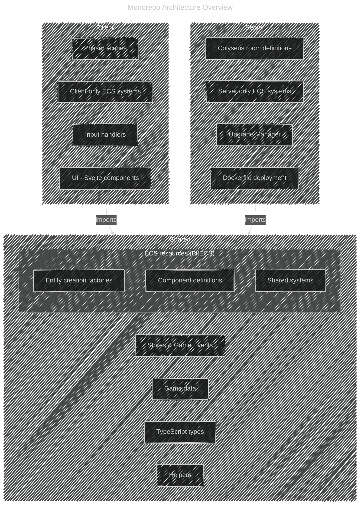

```mermaid
---
title: Monorepo Architecture Overview
config:
  layout: dagre
  look: handDrawn
  theme: dark
---
graph TD
    subgraph client["Client"]
        C1[Phaser scenes]
        C2[Client-only ECS systems]
        C3[Input handlers]
        C4[UI - Svelte components]
    end

    subgraph server["Server"]
        V1[Colyseus room definitions]
        V2[Server only ECS systems]
        V3[Upgrade Manager]
        V4[Dockerfile deployment]
    end

    subgraph ECS["ECS resources (BitECS)"]
      E1[Entity creation factories]
      E2[Component definitions]
      E3[Shared systems]
    end

    subgraph shared["Shared"]
        ECS
        S1[Stores & Game Events]
        S2[Game data]
        S3[TypeScript types]
        S4[Helpers]
    end


    client -->|imports| shared
    server -->|imports| shared
```
