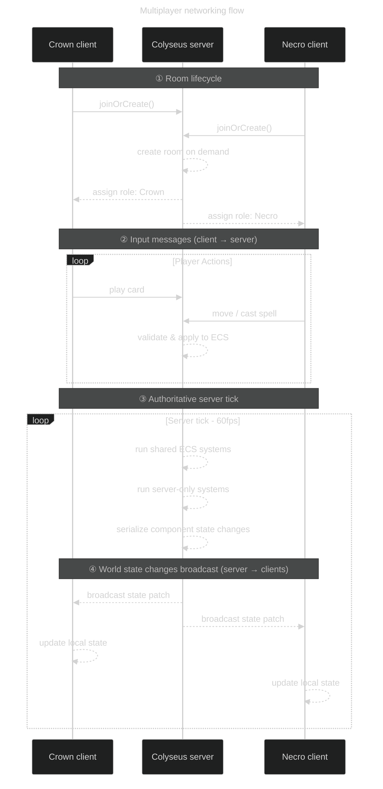

```mermaid
---
title: Multiplayer networking flow
config:
  layout: dagre
  look: handDrawn
  theme: dark
---
sequenceDiagram
    participant CC as Crown client
    participant SRV as Colyseus server
    participant NC as Necro client

    note over CC,NC: ① Room lifecycle

    CC->>SRV: joinOrCreate()
    NC->>SRV: joinOrCreate()
    SRV-->>SRV: create room on demand
    SRV-->>CC: assign role: Crown
    SRV-->>NC: assign role: Necro

    note over CC,NC: ② Input messages (client → server)

    loop Player Actions
        CC->>SRV: play card
        NC->>SRV: move / cast spell
        SRV-->>SRV: validate & apply to ECS
    end

    note over CC,NC: ③ Authoritative server tick

    loop Server tick - 60fps
        SRV-->>SRV: run shared ECS systems
        SRV-->>SRV: run server-only systems
        SRV-->>SRV: serialize component state changes

        note over CC,NC: ④ World state changes broadcast (server → clients)

        SRV-->>CC: broadcast state patch
        SRV-->>NC: broadcast state patch
        CC-->>CC: update local state
        NC-->>NC: update local state
    end
```
